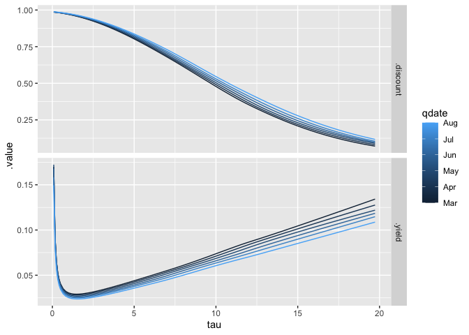

<!-- README.md is generated from README.Rmd. Please edit that file -->

# ycevo

<!-- badges: start -->

[](https://github.com/bonsook/ycevo/actions/workflows/R-CMD-check.yaml)
[](https://CRAN.R-project.org/package=ycevo)
[](https://www.gnu.org/licenses/gpl-3.0.en.html)
<!-- [](https://cran.r-project.org/package=ycevo) -->
<!-- badges: end -->

The goal of `ycevo` is to provide means for the non-parametric
estimation of the discount function and yield curve of bonds.

If you use any data or code from the `ycevo` package CRAN release in a
publication, please use the following citation:

> Bonsoo Koo, and Yangzhuoran Fin Yang (2024). ycevo: Non-Parametric
> Estimation of the Yield Curve Evolution. R package version 0.2.1.
> <https://CRAN.R-project.org/package=ycevo>.

The package provides code used in Koo, La Vecchia, & Linton (2021).
Please use the following citation if you use any result from the paper.

> Koo, B., La Vecchia, D., & Linton, O. (2021). Estimation of a
> nonparametric model for bond prices from cross-section and time series
> information. Journal of Econometrics, 220(2), 562-588.

## Development cycle

The package is in active development and it have been experiencing
substantial changes. Since the existing forks have remained inactive for
several years, significant modifications have been implemented through
rebase. It is advisable for any existing forks to undergo the rebase
process.

    git remote add upstream https://github.com/bonsook/ycevo.git
    git fetch upstream
    git rebase upstream/master
    git push origin master --force

## Installation

You can install the **released** version of ycevo from
[CRAN](https://CRAN.R-project.org) with:

``` r
install.packages("ycevo")
```

You can install the **development** version from
[GitHub](https://github.com/) with:

``` r
# install.packages("devtools")
devtools::install_github("bonsook/ycevo")
```

## Usage

``` r
library(ycevo)
library(lubridate)
#> 
#> Attaching package: 'lubridate'
#> The following objects are masked from 'package:base':
#> 
#>     date, intersect, setdiff, union

## Simulate
set.seed(1)
bonds <- ycevo_data()
bonds
#> # A tibble: 388,795 × 5
#>    qdate      id              price  tupq  pdint
#>    <date>     <fct>           <dbl> <dbl>  <dbl>
#>  1 2023-01-02 20230106.106643  103.     4 103.  
#>  2 2023-01-02 20230721.107768  106.    19   3.88
#>  3 2023-01-02 20230721.107768  106.   200 104.  
#>  4 2023-01-02 20240203.106386  106.    32   3.19
#>  5 2023-01-02 20240203.106386  106.   213   3.19
#>  6 2023-01-02 20240203.106386  106.   397 103.  
#>  7 2023-01-02 20240817.109392  113.    46   4.70
#>  8 2023-01-02 20240817.109392  113.   227   4.70
#>  9 2023-01-02 20240817.109392  113.   411   4.70
#> 10 2023-01-02 20240817.109392  113.   593 105.  
#> # ℹ 388,785 more rows
```

``` r
## Estimate at specified time points
x <- seq(ymd("2023-03-01"), ymd("2023-08-01"), by = "1 month")
res <- ycevo(bonds, x)
## Supports parallel processing and progress bar
# future::plan(future::multisession)
# res <- progressr::with_progress(ycevo(bonds, x))
```

``` r
res
#> # A tibble: 6 × 2
#>   qdate      .est             
#> * <date>     <list>           
#> 1 2023-03-01 <tibble [73 × 3]>
#> 2 2023-04-01 <tibble [73 × 3]>
#> 3 2023-05-01 <tibble [73 × 3]>
#> 4 2023-06-01 <tibble [73 × 3]>
#> 5 2023-07-01 <tibble [73 × 3]>
#> 6 2023-08-01 <tibble [73 × 3]>
```

``` r
## Predict
augment(res)
#> # A tibble: 438 × 4
#>    qdate         tau .discount .yield
#>    <date>      <dbl>     <dbl>  <dbl>
#>  1 2023-03-01 0.0822     0.986 0.169 
#>  2 2023-03-01 0.164      0.985 0.0912
#>  3 2023-03-01 0.247      0.984 0.0654
#>  4 2023-03-01 0.329      0.983 0.0528
#>  5 2023-03-01 0.411      0.982 0.0454
#>  6 2023-03-01 0.493      0.980 0.0407
#>  7 2023-03-01 0.658      0.977 0.0351
#>  8 2023-03-01 0.822      0.974 0.0321
#>  9 2023-03-01 0.986      0.970 0.0305
#> 10 2023-03-01 1.15       0.967 0.0296
#> # ℹ 428 more rows

## Plot
autoplot(res)
```



``` r
## Compare to the true yield curve
curve_true <- list()
for(i in seq_along(x)) {
  curve_true[[i]] <- tibble(
    tau=1:20, 
    qdate = x[[i]],
    .yield = get_yield_at((x[[i]] - ymd("2023-01-01"))/365, tau), 
    .discount = exp(-tau * .yield))
}
curve_true <- bind_rows(curve_true)
curve_true <- pivot_longer(
  curve_true, 
  c(.discount, .yield), 
  names_to = ".est", 
  values_to = ".value")

autoplot(res) +
  geom_line(data = curve_true, linetype = "dashed")
```

## License

This package is free and open source software, licensed under GPL-3
