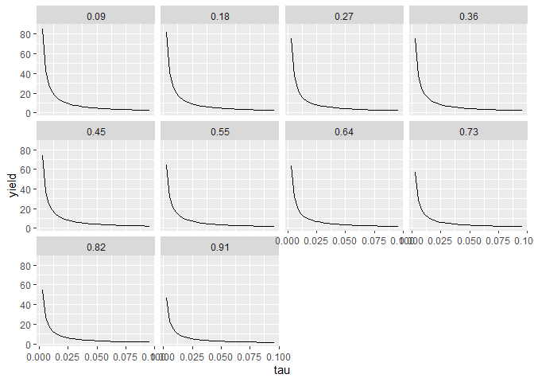
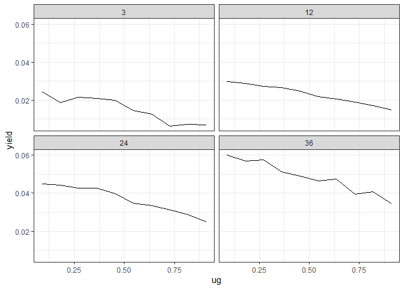

<!-- README.md is generated from README.Rmd. Please edit that file -->

# ycevo

<!-- badges: start -->

[](https://github.com/bonsook/ycevo/actions)
<!-- badges: end -->

The goal of ycevo is to the non-parametric estimation of the discount
rate, and yield curve, of CRSP Bond Data.

If you use any data or code from the `ycevo` package in a publication,
please use the following citation:

> Bonsoo Koo, Nathaniel Tomasetti, Kai-Yang Goh and Yangzhuoran Yang
> (2022). ycevo: Non-Parametric Estimation of the Yield Curve Evolution.
> R package version 1.0.0. <https://github.com/bonsook/ycevo>.

The package provides code used in Koo, La Vecchia, & Linton (2021).
Please use the following citation if you use any result from the paper.

> Koo, B., La Vecchia, D., & Linton, O. (2021). Estimation of a
> nonparametric model for bond prices from cross-section and time series
> information. Journal of Econometrics, 220(2), 562-588.

## Installation

<!-- You can install the released version of ycevo from [CRAN](https://CRAN.R-project.org) with: -->
<!-- ``` r -->
<!-- install.packages("ycevo") -->
<!-- ``` -->

The **stable** version on CRAN is coming soon.

The **development** version from [GitHub](https://github.com/) with:

``` r
# install.packages("devtools")
devtools::install_github("bonsook/ycevo")
```

## Usage

``` r
library(ycevo)
library(tidyverse)
#> ── Attaching packages ─────────────────────────────────────── tidyverse 1.3.1 ──
#> ✓ ggplot2 3.3.5     ✓ purrr   0.3.4
#> ✓ tibble  3.1.6     ✓ dplyr   1.0.8
#> ✓ tidyr   1.2.0     ✓ stringr 1.4.0
#> ✓ readr   2.1.2     ✓ forcats 0.5.1
#> ── Conflicts ────────────────────────────────────────── tidyverse_conflicts() ──
#> x dplyr::filter() masks stats::filter()
#> x dplyr::lag()    masks stats::lag()
library(lubridate)
#> 
#> Attaching package: 'lubridate'
#> The following objects are masked from 'package:base':
#> 
#>     date, intersect, setdiff, union

# Simulate 4 bonds issued at 2020-01-01
# with maturity 180, 360, 540, 720 days
# Apart from the first one, 
# each has coupon 2, 
# of which half is paid every 180 days.
# The yield curve is sumulated fron `get_yield_at_vec`
# Quotation date is also at 2020-01-01
exp_data <- tibble(
  qdate = ymd("2020-01-01"), 
  crspid = rep(1:4, 1:4), 
  pdint = c(100, 1, 101, 1, 1, 101, 1, 1, 1, 101),
  tupq = unlist(sapply(1:4, seq_len)) * 180, 
  accint = 0
) %>% 
  mutate(discount = exp(-tupq/365 * get_yield_at_vec(0, tupq/365))) %>% 
  group_by(crspid) %>% 
  mutate(mid.price = sum(pdint * discount)) %>% 
  ungroup()

# Only one quotation so time grid is set to 1
xgrid <- 1 
# Discount function is evaluated at time to maturity of each payment in the data
tau <- unique(exp_data$tupq/365) 

# Estimated yield and discount
yield <- ycevo(
  exp_data, 
  xgrid = xgrid,
  tau = tau
)
yield 
#>    discount xgrid       tau      yield
#> 1 0.9801882     1 0.4931507 0.04057724
#> 2 0.9654370     1 0.9863014 0.03566294
#> 3 0.9515561     1 1.4794521 0.03356421
#> 4 0.9365043     1 1.9726027 0.03325614

# True yield
get_yield_at_vec(0, tau)
#> [1] 0.04057724 0.03566294 0.03356421 0.03325614

# Plot of yield curve
yield %>%
  mutate(true_yield = get_yield_at_vec(0, tau)) %>% 
  pivot_longer(c(yield, true_yield)) %>% 
  mutate(xgrid = round(xgrid, 2)) %>%
  ggplot() + 
  geom_line(aes(x = tau, y = value)) +
  facet_wrap(name~xgrid, labeller = label_both)
```



``` r

# Plot of discount function
yield %>%
  mutate(true_discount = exp(-tau * get_yield_at_vec(0, tau))) %>% 
  pivot_longer(c(discount, true_discount)) %>% 
  mutate(xgrid = round(xgrid, 2)) %>%
  ggplot() + 
  geom_line(aes(x = tau, y = value)) +
  facet_wrap(name~xgrid, labeller = label_both)
```



## License

This package is free and open source software, licensed under GPL-3
